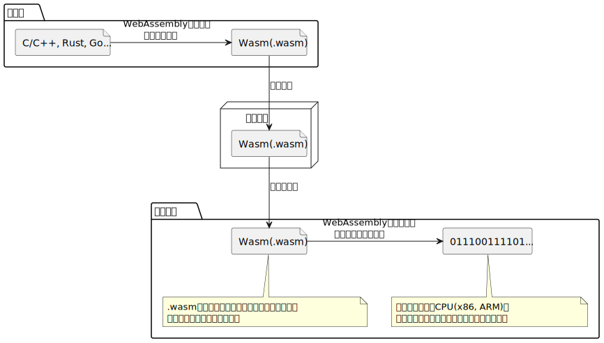

# Wasm x WebEditor

Beer Bash🍻 2022/11/11

Portalチーム 越智 大貴

---

# 章立て
- なんでWasm（WebAssembly）をテーマにしたのか
- WebAssemblyとはなにか
- 強み
- WebAssemblyが動くまで
- WasmモリモリWebEditorの紹介
- 付録
- 出典

---
# なんでWasm（WebAssembly）をテーマにしたのか
- Goで作ったライブラリ・CLIツールをWebアプリとして公開できないかな...でもわざわざWebAPIは作りたくないし...
  - 確か、GoはWasmにビルドできたような...
- 動いた！**コードが再利用できた**！凄い！
- でもWebAssembly良く知らないな...
- ということでこのテーマにしました
  - (何か動くものを作りたかったので、`x WebEditor` にしました)

---
# WebAssemblyとはなにか１
- 前身としてasm.jsがいた
  - JavaScriptのパフォーマンスを向上させるため、Mozilla社が開発
  - C/C++のコードをJavaScriptへトランスパイルすることができる
  - 特定の書き方をすると、ブラウザでの実行までの速度・実行時の速度をはやくできる

---
# WebAssemblyとはなにか２
- asm.js -> WebAssemblyへ
  - asm.jsの欠点に対処して利点を最大限に活かすために開発された
  - **ブラウザでネイティブコードに近い速度で実行できる**
  - **C/C++, Rust, Goなどの言語で書かれたコードをWebAssemblyにコンパイルしてブラウザで動作させることが可能**

---
# 強み
- **ブラウザでネイティブコードに近い速度で実行できる**
- **ブラウザでJavaScript以外のプログラミング言語が使える**
  - 関連して、**コードの再利用ができる**（実体験）

---
## とはいえ
- WebAssemblyがJavaScriptを置き換えるものではなさそうです
  - 単純な処理に、わざわざJavaScript以外の言語でコードを書いてWasmへコンパイルするのは効率が悪そうに思います
  - 実体験としてGo（実際はTinyGo）でコンパイルした.wasmファイルがそこそこサイズあるなと思いました（その他の静的ファイルと比べて）
    - なので処理を高速化したいところを局所的にWasmで作れるといいのかなと思っています
    - ブラウザキャッシュから使えるようにしておくのは対策としていいのかなと思ってます（ServiceWorker）

---

# WebAssemblyが動くまで

---
# 自作WebEditorの紹介

- 各機能に.wasmの処理を呼び出すWebEditorです
  - PHPコードの実行: https://github.com/seanmorris/php-wasm
  - Pythonコードの実行: https://github.com/pyodide/pyodide
  - YAMLのフォーマット: https://github.com/sosukesuzuki/js-yamlfmt

- エディタには https://github.com/microsoft/monaco-editor

---
# 最後に

## 既存のコードを再利用できるのは便利!!

---
# 付録
- WasmモリモリWebEditor
  - (要link)
  - 以下は利用したOSS
    - https://github.com/microsoft/monaco-editor
    - https://github.com/seanmorris/php-wasm
    - https://github.com/pyodide/pyodide
    - https://github.com/sosukesuzuki/js-yamlfmt

- プログラミング言語毎にまとめられたWebAssemblyに関連したリンク集
  - https://github.com/appcypher/awesome-wasm-langs

- Wasmで処理する趣味Webアプリ
  - https://ddddddo.github.io/gtree/

---

# 出典
- ハンズオン WebAssembly(2022, オライリージャパン) 第１部
